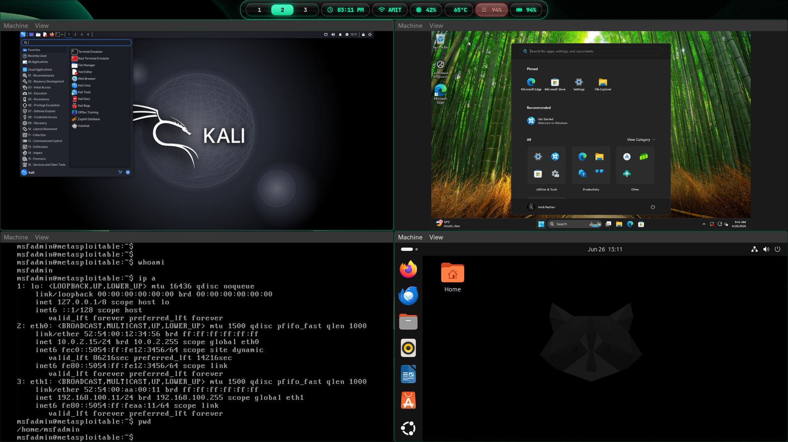

# QEMU/KVM Cybersecurity Lab on Arch Linux

Welcome! This repository contains a step-by-step guide and automation scripts to build a high-performance, fully isolated cybersecurity lab using **QEMU/KVM** on **Arch Linux**. 

Whether you are studying for a networks exam, practicing penetration testing, or conducting malware analysis, this setup provides a safe sandbox environment to run and attack target VMs without messing up your host system or home network.



### 🎥 Lab Setup Demo


Use the play control in the embedded video to watch the setup demo.

---

## Lab Features

* 💻 **Windows 11 VM**: Modern Windows client target with UEFI OVMF boot, Secure Boot, and virtualized TPM 2.0.
* 💀 **Metasploitable2 VM**: Legacy vulnerable Linux target loaded with exploits and backdoor services.
* 🐧 **Ubuntu & Kali Linux VMs**: High-performance Linux VMs utilizing native kernel speed.
* 🌐 **Dual-Network Topology**:
  * **NAT Interface**: Internet access for downloading tools/packages.
  * **Private Host-Only Bridge (`br0`)**: Isolated private switch for scanning, exploits, and traffic capture without host leakage.
* 📸 **Save-States / Snapshots**: Revert your VMs to a clean checkpoint in 2 seconds if they break.
* ⚡ **Hardware Acceleration**: GPU acceleration with OpenGL (`virtio-vga-gl`) and low-overhead VirtIO storage/network adapters.

---

## Quick Navigation

Here are the step-by-step guides inside the `docs/` folder:

### 1. Conceptual Guides
* ❓ **[What is QEMU/KVM?](qemu-kvm.md)**: A quick breakdown of how QEMU and the Linux KVM kernel module work together at native speed.
* 🌐 **[Networking Topology](docs/networking.md)**: Details on why we use a dual-interface network and our IP address plan.

### 2. Infrastructure Setup
* 🔌 **[Linux Network Bridge (`br0`)](docs/bridge.md)**: How to manually create a virtual switch and TAP interfaces using `iproute2`.
* 🛡️ **[TPM 2.0 Virtualization (`swtpm`)](docs/tpm.md)**: Emulating a physical TPM 2.0 chip using software sockets for Windows 11 compliance.

### 3. VM Installation Guides
* 🏁 **[Windows 11 Setup Guide](docs/windows11.md)**: Detailed tutorial on loading drivers, bypassing MS accounts, and installing guest tools.
* 🎯 **[Metasploitable2 Setup Guide](docs/metasploitable2.md)**: Legacy boot configuration using IDE storage and Intel E1000 network cards.
* 🖥️ **[Ubuntu Setup Guide](docs/ubuntu.md)** (Stub)
* ⚔️ **[Kali Linux Setup Guide](docs/kali.md)** (Stub)

### 4. Lab Management & Utilities
* 💾 **[Virtual Machine Snapshots](docs/snapshots.md)**: How to save, list, restore, and delete QCOW2 checkpoints live or offline.
* 🛠️ **[Troubleshooting Guide](docs/troubleshooting.md)**: Fixes for permission denied on `/dev/kvm`, bios settings, socket lockups, and laggy screens.

---

## Getting Started: Host Requirements

To get the virtualization stack installed on your Arch Linux host, run:

```bash
sudo pacman -S qemu-full edk2-ovmf swtpm bridge-utils dnsmasq
```

Make sure your host CPU has virtualization support enabled in the BIOS/UEFI (SVM for AMD, VT-x for Intel). Then, add your user to the `kvm` and `libvirt` groups so you can run QEMU without root permissions:

```bash
sudo usermod -aG kvm,libvirt $USER
```
*(Remember to log out and log back in for changes to apply).*

---

## Lab Architecture Overview
