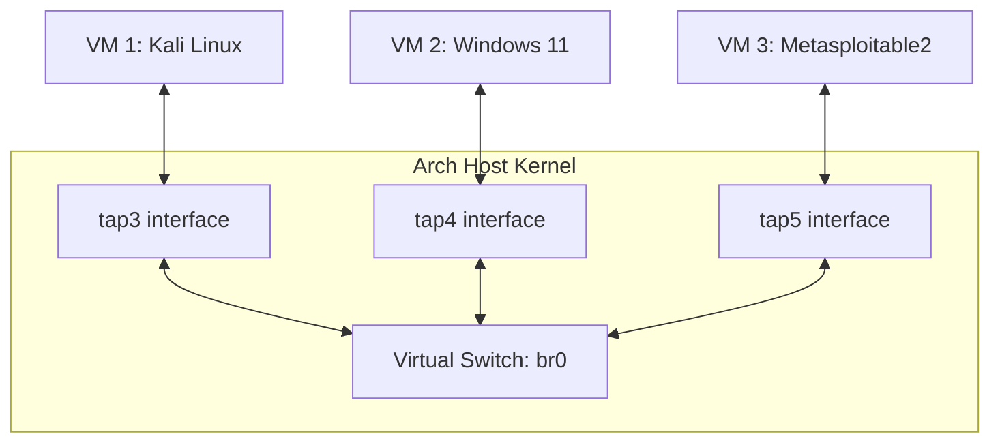

# Linux Network Bridge & TAP Interfaces (Arch Linux Setup)

So, if you are building a virtual cybersecurity lab, networking is literally the most important part. You can't just have your Kali Linux VM and a Windows 11 target sitting there without talking to each other. If you want to scan ports, run exploits, or test payloads, they all need to be on the same local network.

But here is the catch: we *definitely* don't want to expose our local home Wi-Fi or hostel network to malware, scans, or sketchy traffic. 

To solve this, we are going to set up a private **Linux Network Bridge** and some **TAP interfaces**. Think of it as creating our own isolated virtual LAN switch right inside our host machine.

---

## Table of Contents

* [So, what is a Linux Bridge anyway?](#so-what-is-a-linux-bridge-anyway)
* [Why are we even using this?](#why-are-we-even-using-this)
* [How does this whole setup work?](#how-does-this-whole-setup-work)
* [Let's set it up on Arch Linux (Step-by-Step)](#lets-set-it-up-on-arch-linux-step-by-step)
  * [1. Install the tools](#1-install-the-tools)
  * [2. Make the virtual bridge](#2-make-the-virtual-bridge)
  * [3. Create the TAP interfaces for our VMs](#3-create-the-tap-interfaces-for-our-vms)
  * [4. Plug the TAP interfaces into the bridge](#4-plug-the-tap-interfaces-into-the-bridge)
* [Giving our host an IP on the bridge](#giving-our-host-an-ip-on-the-bridge)
* [Connecting it all to QEMU](#connecting-it-all-to-qemu)
* [If things break (Troubleshooting)](#if-things-break-troubleshooting)

---

# So, what is a Linux Bridge anyway?

Basically, a **Linux Network Bridge** is just a virtual **Layer 2 network switch** running inside the Linux kernel. 

It behaves exactly like those physical D-Link or Netgear switches we use in our college computer network labs. It doesn't care about routing tables or IP addresses. It only looks at MAC addresses and forwards packets (Ethernet frames) to whatever device is plugged into it. 

On our Arch Linux host, it just shows up as a virtual network device, usually named `br0`.

---

# Why are we even using this?

Honestly, using a host-only bridge is the best way to run virtual labs. Here is why:

* **Complete Isolation (No Hostel Wi-Fi issues)**: Everything stays inside a private sandbox. Your VMs can talk to each other at high speeds, but none of the scanning or exploit traffic leaks onto your home network or hostel Wi-Fi (saving you from getting flagged by network admins!).
* **Wireshark Sniffing**: Since `br0` acts as a central switch for all VM traffic, you can open Wireshark on your Arch host and start sniffing packets directly on the `br0` interface. You can capture and analyze every single TCP handshake, exploit payload, or reverse shell connection between Kali and Windows.
* **Easy Static IPs**: Because the subnet is entirely ours, we can assign nice static IPs (like `192.168.100.x`) without worrying about IP collisions with other devices in our house.

---

# How does this whole setup work?

The bridge itself is just an empty virtual switch. To connect our VMs to it, we need virtual network cables. These "cables" are called **TAP interfaces**.

Here is a quick block diagram of how they fit together:



1. **TAP Interface**: It's a virtual network card created on the host side.
2. **VM Plugin**: When QEMU boots up a VM, it binds the VM's virtual network card to the host's TAP interface.
3. **Bridge Connection**: We tell the Linux kernel to plug the TAP interface into our bridge `br0`. 
4. **Communication**: When Kali sends a packet to Windows 11, it goes through QEMU to `tap3`, drops onto the `br0` bridge, which then routes it to `tap4` and straight into Windows 11.

---

# Let's set it up on Arch Linux (Step-by-Step)

We are going to use the native kernel commands (`iproute2`) to do this manually. It's much faster and teaches you how Linux networking works under the hood.

### 1. Install the tools
Arch already has the core commands, but let's install `bridge-utils` just in case we need legacy commands:

```bash
sudo pacman -S bridge-utils
```

### 2. Make the virtual bridge
First, let's create our bridge interface and name it `br0`:

```bash
sudo ip link add name br0 type bridge
```

Now, bring it online:

```bash
sudo ip link set dev br0 up
```

### 3. Create the TAP interfaces for our VMs
Each VM needs its own virtual cable. Let's create `tap3` for our first VM. 

Since we want to run QEMU as a normal user (running QEMU as root/sudo is a bad practice), we must tell the kernel that our local user owns this TAP interface:

```bash
# Replace $USER with your Arch username if needed, but $USER is automatic
sudo ip tuntap add name tap3 mode tap user $USER
```

### 4. Plug the TAP interfaces into the bridge
Now, connect `tap3` to our bridge switch:

```bash
sudo ip link set dev tap3 master br0
```

Finally, turn the TAP interface on:

```bash
sudo ip link set dev tap3 up
```

If you are setting up more VMs, just repeat steps 3 and 4 to create `tap4`, `tap5`, etc., and bind them all to `br0`.

---

# Giving our host an IP on the bridge

By default, the bridge is isolated, meaning even your Arch host can't ping the VMs. 

If you want your host to act as a gateway (e.g. to run a local DHCP server or access services hosted inside the VMs), you just need to assign an IP address to the bridge interface itself:

```bash
sudo ip addr add 192.168.100.1/24 dev br0
```

Now, the host is reachable at `192.168.100.1` by any VM sitting on the `192.168.100.x` subnet.

---

# Connecting it all to QEMU

To tell QEMU to plug the VM into our new bridge setup, append these lines to your VM launch script:

```bash
qemu-system-x86_64 \
  ... \
  -netdev tap,id=lab,ifname=tap3,script=no,downscript=no \
  -device virtio-net-pci,netdev=lab,mac=52:54:00:AA:00:13 \
  ...
```

* `-netdev tap,...,ifname=tap3`: Connects QEMU to our pre-configured `tap3` interface on the host. The `script=no,downscript=no` flags are super important—they tell QEMU not to try running any root-level network configuration scripts.
* `-device virtio-net-pci,...,mac=52:54:00:AA:00:13`: Emulates a fast VirtIO network card. 
* **Pro-tip**: You **must** change the MAC address (`mac=52:54:00:AA:00:XX`) for every single VM you run. If you use the exact same MAC address on multiple VMs, they will conflict on the bridge, and your network will completely break!

---

# If things break (Troubleshooting)

### Error: `qemu-system-x86_64: -netdev tap...: Device or resource busy`
* **Why**: Another VM is already running on `tap3`, or the interface was left open when a VM crashed.
* **Fix**: Assign a unique TAP interface per VM (e.g. `tap3` for Windows, `tap4` for Kali). To reset a stuck interface, delete it and recreate it:
  ```bash
  sudo ip link delete tap3
  ```

### VMs can't ping each other
* **Why**: The TAP interfaces are either down or not linked to the bridge, or the guest OS firewalls are blocking pings.
* **Fix**:
  1. Check if the TAPs are plugged into `br0`:
     ```bash
     ip link show master br0
     ```
     You should see `tap3`, `tap4`, etc. in the list.
  2. Make sure they are all turned up:
     ```bash
     ip link show br0
     ```
  3. Turn off Windows Defender / Windows Firewall on the guest VM to see if it's blocking ICMP ping requests.

### Host can't talk to VMs
* **Why**: You forgot to assign an IP to `br0` on the host side, or the guest VMs are configured on a completely different IP subnet.
* **Fix**: Add the IP to the bridge: `sudo ip addr add 192.168.100.1/24 dev br0`. Then make sure the VMs have static IPs in the same range, like `192.168.100.10`.
