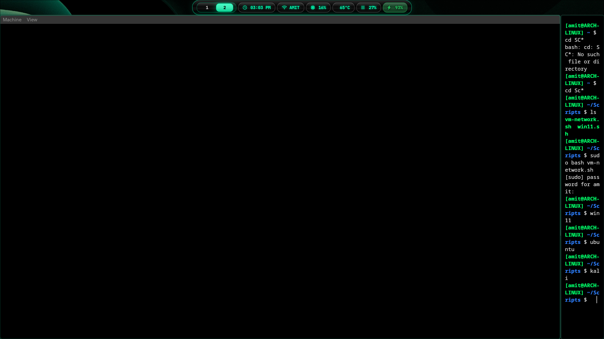
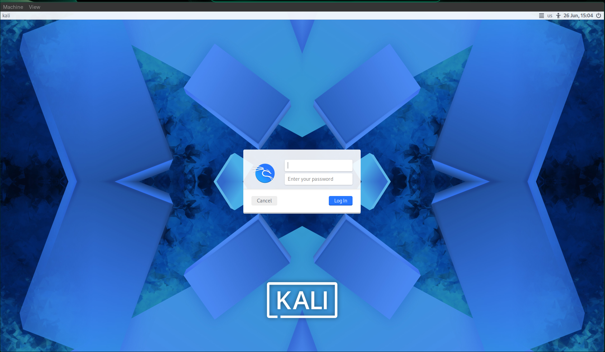
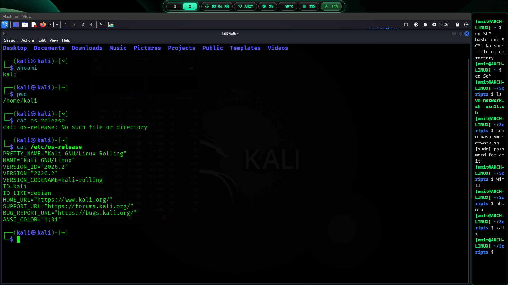

# Kali Linux Guide: The Attacker Workstation (B.Tech CS Lab Notes)

Every cybersecurity lab needs a cockpit. For us, that is **Kali Linux**. It is our offensive base of operations, the VM where we run our scans, listen for reverse shells, write exploit payloads, and monitor network traffic. 

Instead of cluttering your Arch host with random hacking tools or running them natively, we boot Kali in an isolated, high-performance QEMU/KVM virtual machine. This guide will walk you through setting it up with dual-network cards, UEFI boot support, and full integration into our private bridge.

---

## What we're covering:
* [Why Kali Linux?](#why-kali-linux)
* [Our Performance Choices (VirtIO & Hardware Acceleration)](#our-performance-choices-virtio--hardware-acceleration)
* [Preparing the Lab Directory](#1-preparing-the-lab-directory)
* [Creating the Virtual Disk](#2-creating-the-virtual-disk)
* [The QEMU Shell Alias (Dual NIC Setup)](#3-the-qemu-shell-alias-dual-nic-setup)
* [Installing the OS (Step-by-Step Screenshots)](#4-installing-the-os-step-by-step-screenshots)
* [Post-Install: Static IP Configuration inside Kali](#5-post-install-static-ip-configuration-inside-kali)

---

# Why Kali Linux?

**Kali Linux** is a Debian-derived distribution designed specifically for digital forensics, penetration testing, and security auditing. It comes pre-packaged with over 600 offensive tools:
* **Information Gathering**: `nmap`, `dnsrecon`
* **Vulnerability Analysis**: `nikto`, `sqlmap`
* **Exploitation**: `metasploit-framework`, `searchsploit`
* **Sniffing & Spoofing**: `wireshark`, `bettercap`
* **Password Attacks**: `john`, `hashcat`, `hydra`

Running it in QEMU gives us a sterile attacker environment. If you accidentally download a nasty payload or crash the guest OS during a scanning test, you can revert Kali to a clean snapshot in 2 seconds without risking your Arch host system.

---

# Our Performance Choices (VirtIO & Hardware Acceleration)

We want Kali to run at near-native speed. Unlike VirtualBox or VMware which use heavy software emulation, we configure:
1. **VirtIO Disk & Network Drivers** (`if=virtio` and `virtio-net-pci`): These communicate directly with the host kernel's hypervisor, completely bypassing legacy hardware emulation.
2. **UEFI Boot Support**: Using the official EDK II OVMF firmware (`OVMF_CODE.4m.fd`) for a modern EFI system state.
3. **VirtIO Graphics**: Direct native rendering via `virtio-vga` to speed up the XFCE desktop environment inside the GTK window.

---

# 1. Preparing the Lab Directory

Keep your virtual machines organized! Let's create a dedicated folder inside your user home directory to store Kali's disk image:

```bash
mkdir -p ~/VMs/kali
```

Download the latest **Kali Linux Installer Image (x64 ISO)** from the [official Kali website](https://www.kali.org/downloads/). We assume it is saved in your host's downloads directory: `~/Downloads/ISO/kali-linux-202X.X-installer-amd64.iso` (replace the version numbers in your commands accordingly).

---

# 2. Creating the Virtual Disk

Now, let's create a dynamic virtual disk using `qemu-img`. We'll give it a max size of **40 GB** (since it is a dynamic QCOW2 image, it will only occupy a couple of gigabytes on your host storage initially and grow as you install tools).

```bash
qemu-img create -f qcow2 ~/VMs/kali/kali.qcow2 40G
```

Expected output:
```text
Formatting '/home/user/VMs/kali/kali.qcow2', fmt=qcow2 cluster_size=65536 extended_l2=off compression_type=zlib size=42949672960 lazy_refcounts=off refcount_bits=16
```

---

# 3. The QEMU Shell Alias (Dual NIC Setup)

To let Kali communicate with both the outer internet (to download exploits, install packages, and update tools) and our private isolated subnet, we plug in **two virtual network cards**:
* **Card 1 (`netdev=internet`)**: Standard User mode NAT. Connects to the host's internet connection.
* **Card 2 (`netdev=lab`)**: Bound to `tap2` which is connected to our virtual bridge (`br0`). This is our dedicated hacking interface.

Rather than copying a shell script execution file, we run this VM using a convenient shell **alias** in our host's `~/.bashrc` (or `~/.zshrc`).

Add this line to your `~/.bashrc`:

```bash
alias kali='qemu-system-x86_64 -enable-kvm -machine q35,accel=kvm -cpu host -smp 4 -m 4G -device virtio-vga -display gtk -drive if=pflash,format=raw,readonly=on,file=/usr/share/edk2/x64/OVMF_CODE.4m.fd -drive file=$HOME/VMs/kali/kali.qcow2,format=qcow2,if=virtio -netdev user,id=internet -device virtio-net-pci,netdev=internet -netdev tap,id=lab,ifname=tap2,script=no,downscript=no -device virtio-net-pci,netdev=lab,mac=52:54:00:AA:00:12 -daemonize'
```

Apply the changes to your terminal:
```bash
source ~/.bashrc
```

### Pro-tips:
1. Make sure you run your bridge setup script as root first so that `br0` and `tap2` exist:
   ```bash
   sudo ./scripts/bridge.sh
   ```
2. When installing the VM for the first time, append `-cdrom $HOME/Downloads/ISO/kali-linux-XXXX.X-installer-amd64.iso` and remove the `-daemonize` flag temporarily from your alias line so you can interact with the installation screen.
3. Once installation is complete, the standard alias (with `-daemonize`) runs the VM in the background, launching the display window without tying up your host terminal process.

---

# 4. Installing the OS (Step-by-Step Screenshots)

Run your launch command to start the installation:
```bash
# Add the installer CD-ROM to the alias command temporarily to run the install
kali -cdrom ~/Downloads/ISO/kali-linux-202X.X-installer-amd64.iso
```

QEMU will boot up a graphical window. 

### Step 4.1: Booting the Installer
Choose **Graphical Install** from the GRUB boot menu.



Proceed through the standard language, region, and keyboard selection options. When prompted for network configuration:
* The installer might ask which network interface to use as primary. Pick the interface associated with the **User Mode NAT** card (typically the first interface, e.g. `eth0` or `ens3`) so it can fetch mirror packages if needed during setup.
* Set the hostname to `kali` and configure a standard user account.

### Step 4.2: Disk Partitioning
Select **Guided - use entire disk**. When it detects the VirtIO drive, choose the QEMU Virtual Disk (`vda`). Keep the partition scheme simple (all files in one partition) and commit changes to disk.

### Step 4.3: Package Selection
Stick to the default package selections (Desktop Environment: XFCE, and standard collection of tools). Once completed, install the **GRUB bootloader** to the primary drive and let it reboot.

### Step 4.4: Login Screen
After rebooting, you will be greeted by the custom Kali login screen. Enter the username and password you created during setup.



### Step 4.5: The Kali Desktop
Welcome to your new hacking terminal! You will see the clean XFCE desktop environment loaded with the offensive security menu structure.


---

# 5. Post-Install: Static IP Configuration inside Kali

Open a terminal in Kali and verify the interface names:
```bash
ip link show
```

You should see two main network interfaces (besides `lo`):
1. `eth0` (or `ens3`): Connected to User Mode NAT. It will have an auto-assigned IP like `10.0.2.15`.
2. `eth1` (or `ens4`): Connected to our bridge `br0` via `tap2`. It will not have an IP yet.

### Option A: Using the Graphical NetworkManager (Easiest)

Click on the network icon in the top right corner of the XFCE panel and click **Edit Connections...**

1. Locate the connection corresponding to the second interface (e.g., `Wired connection 2` or `eth1`).
2. Double-click to edit it and navigate to the **IPv4 Settings** tab.
3. Change the method from **Automatic (DHCP)** to **Manual**.
4. Click **Add** and fill in the details:
   * **Address**: `192.168.100.10`
   * **Netmask**: `255.255.255.0` (or `24` CIDR)
   * **Gateway**: *Leave empty!* (If you set a gateway on Card 2, it will conflict with Card 1's internet routing, cutting off your internet).
5. Click **Save**, open your terminal, and restart the networking service:
   ```bash
   sudo systemctl restart NetworkManager
   ```

### Option B: The Command Line Way (For Terminal Wizards)

If you prefer editing configuration files, you can manage interfaces using Debian's native `/etc/network/interfaces` file. Open the file:

```bash
sudo nano /etc/network/interfaces
```

Append the following configuration for the second interface (verify if your interface is named `eth1` or `ens4` using `ip a` first):

```text
# Internet Connection via User NAT (DHCP)
auto eth0
iface eth0 inet dhcp

# Isolated Lab Bridge Connection (Static)
auto eth1
iface eth1 inet static
    address 192.168.100.10
    netmask 255.255.255.0
```

Restart the network interfaces:
```bash
sudo systemctl restart networking
```

Verify your configuration using the terminal:



Confirm that:
* You can ping the outside world: `ping -c 3 google.com` (routes through `eth0`).
* You can ping your Arch host gateway on the private network: `ping -c 3 192.168.100.1`.

If both succeed, Kali is fully set up and ready to launch scans against other target virtual machines in the lab!
