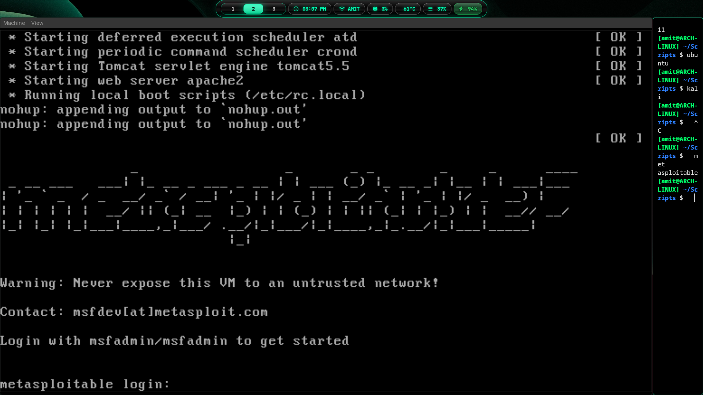
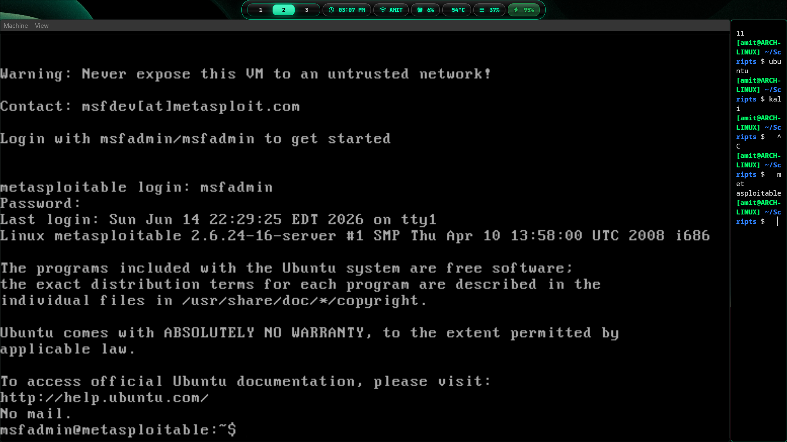

# Metasploitable2 Guide: The Ultimate Hacking Target (B.Tech Lab Notes)

When you are learning penetration testing, you need a target to practice on. You can't just go scan or attack real websites (that is highly illegal and will get you expelled or arrested). 

Instead, we use **Metasploitable2**—an intentionally vulnerable Linux virtual machine. This guide covers what it is, why it exists, why you should NEVER use it as a main OS, and how to boot it up using QEMU/KVM.

---

## What we're covering:

* [What is Metasploitable2?](#what-is-metasploitable2)
* [The purpose of this OS](#the-purpose-of-this-os)
* [WARNING: Why you should NEVER use it as a main OS](#warning-why-you-should-never-use-it-as-a-main-os)
* [QEMU/KVM Setup (Legacy IDE & E1000 drivers)](#qemukvm-setup-legacy-ide--e1000-drivers)
* [Accessing Metasploitable2 (Default logins)](#accessing-metasploitable2-default-logins)

---

# What is Metasploitable2?

**Metasploitable2** is an Ubuntu-based virtual machine created by the security company Rapid7 (the creators of Metasploit). 

Unlike modern operating systems that try to be as secure as possible, Metasploitable2 is designed to be **as insecure as possible**. It is packed with dozens of known security vulnerabilities, outdated packages, open ports, backdoors, and weak configurations. 

Basically, it's a digital punching bag for security students.

---

# The purpose of this OS

The main reason we run Metasploitable2 in our lab is to practice penetration testing tools safely and legally:

* **Nmap scanning**: You can run intense scans to detect open ports, run services, and operating system versions without crashing the machine or setting off intrusion alarms.
* **Metasploit practice**: You can practice using the Metasploit Framework to search for exploits, set payloads, and execute them to gain root access.
* **Brute-forcing tests**: Practice brute-forcing weak services (SSH, Telnet, FTP, Tomcat) using tools like Hydra.
* **Web application hacking**: It hosts vulnerable web apps like DVWA (Damn Vulnerable Web Application) and Mutillidae, where you can learn SQL injection, Cross-Site Scripting (XSS), and command injection.

---

# WARNING: Why you should NEVER use it as a main OS

This is a serious warning. Metasploitable2 is built to be hacked. 

* **No Firewalls, No Patches**: It runs extremely outdated software from 2008-2012 that has publicly available exploits.
* **Backdoors by Design**: Services like `vsftpd` have backdoors built into them (e.g. typing a smiley face `:)` in the username triggers a shell on port 6200).
* **Weak default credentials**: The default root-level administrative account has a static, widely-known password.
* **Do not expose it to the internet**: If you bridge this VM directly to your home router or hostel Wi-Fi, **your VM will be compromised within 5 minutes**. Anyone on the subnet scanning for ports will instantly gain full root control over the machine. 

This is why we plug Metasploitable2 **ONLY** into our isolated bridge `br0` (`192.168.100.x` network) and make sure it has no direct route to the open internet!

---

# QEMU/KVM Setup (Legacy IDE & E1000 drivers)

Because Metasploitable2 is an older, 32-bit Linux OS (based on Ubuntu 8.04), it doesn't support modern VirtIO storage drivers or UEFI secure boot out of the box. 

If you try to run it with UEFI (`edk2-ovmf`) or VirtIO storage (`if=virtio`), it will refuse to boot or fail to find the disk. 

We need to boot it using **legacy IDE disk emulation** and a standard **Intel E1000 network card**.

Here is the QEMU launch command:

```bash
qemu-system-x86_64 \
  -enable-kvm \
  -machine q35,accel=kvm \
  -m 1G \
  -smp 2 \
  -display gtk \
  -boot c \
  -drive file=$HOME/VMs/metasploitable2/metasploitable.qcow2,format=qcow2,if=ide \
  -netdev tap,id=lab,ifname=tap5,script=no,downscript=no \
  -device e1000,netdev=lab,mac=52:54:00:AA:00:30
```

### Key Parameters:
* `-m 1G`: It only needs 1 GB of RAM (it doesn't run a graphical desktop, only a terminal command line).
* `if=ide`: Emulates an older IDE hard disk controller instead of VirtIO.
* `-device e1000`: Emulates an Intel E1000 Gigabit network card, which is widely supported by older Linux kernels.
* `tap5`: Connects to our fifth TAP interface on the host, which is plugged into our private bridge `br0`.

---

# Accessing Metasploitable2 (Default logins)

When the VM finishes booting, you won't see a desktop. You'll just see a standard terminal login prompt.



* **Default Username**: `msfadmin`
* **Default Password**: `msfadmin`

Once logged in, you can check its IP address:

```bash
ifconfig eth0
```



Ensure it has picked up the IP `192.168.100.30` (configure it statically in `/etc/network/interfaces` inside the VM if needed). Now you can start scanning it from your Kali Linux VM!
