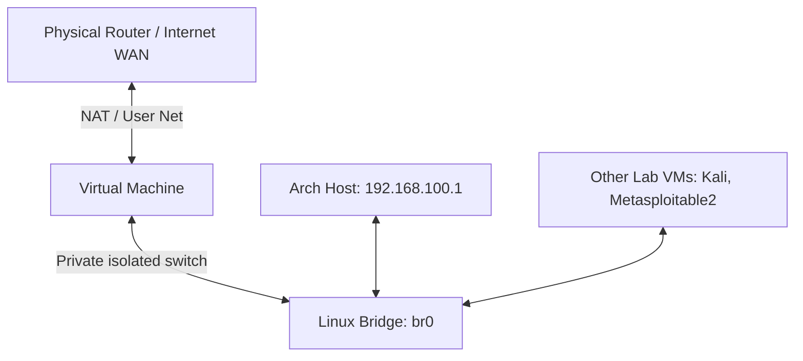

# Cybersecurity Lab Network Topology (B.Tech CS Lab Guide)

If you are running a cybersecurity lab, virtual machines on their own are useless if they are completely cut off from each other. An attacker VM needs a way to send packets to a victim VM. This guide covers how networking works in our lab, why we need it, and how we set it up.

---

## What we're covering:

* [What actually is networking?](#what-actually-is-networking)
* [Why do we need networking in a security lab?](#why-do-we-need-networking-in-a-security-lab)
* [Why did we design our lab network this way? (Our Topology)](#why-did-we-design-our-lab-network-this-way-our-topology)
* [The Dual-Network Layout (How it works under the hood)](#the-dual-network-layout-how-it-works-under-the-hood)
* [IP Address Plan for our Lab](#ip-address-plan-for-our-lab)

---

# What actually is networking?

Basically, networking is just hooking up two or more computers so they can talk to each other. 

Instead of using actual physical CAT6 cables, QEMU creates virtual network cards (NICs) for our VMs. These cards send packets (chunks of data, like TCP or UDP) over virtual switches (our `br0` bridge interface) so that the operating systems think they are plugged into a real-world router or switch.

---

# Why do we need networking in a security lab?

If you are studying cybersecurity, you cannot practice anything without a network. Here's why:

* **Simulating real attacks**: In the real world, hackers don't have physical access to targets. They attack over the network. To practice network scanning (nmap), sniffing (Wireshark), or executing exploits, we need a network path between the attacker and the victim.
* **Testing client-server tools**: Active Directory setups, web servers, and database exploits all run on a client-server architecture. They need a network connection to handshake and exchange data.
* **Traffic analysis**: To learn how firewalls, IDS (Intrusion Detection Systems), or Wireshark work, we need actual packets flowing across a network interface so we can capture and study them.

---

# Why did we design our lab network this way? (Our Topology)

We can't just connect our lab VMs directly to our home or college Wi-Fi. If we run active scans or test malware, the network administrators will block us, or worse, we might accidentally infect or attack someone else's physical PC in the hostel.

So, we implement a **Dual-Network Topology**:



Every VM in our lab gets **two network cards**:

1. **Card 1: User/NAT Network (Internet)**: Connects the VM to the internet through the host's network. The VM can download updates, install tools, and browse the web, but physical devices on your home network cannot see or connect to the VM.
2. **Card 2: Isolated Private Network (The Lab)**: Connects the VM to our virtual bridge (`br0`). There is no internet access on this card, and it is completely isolated from your home network. This is where the hacking and malware testing happen.

---

# The Dual-Network Layout (How it works under the hood)

Here is what the QEMU command looks like to give a VM this dual-network setup:

```bash
qemu-system-x86_64 \
  ... \
  # Network Card 1: Internet via User-mode NAT
  -netdev user,id=internet \
  -device virtio-net-pci,netdev=internet \
  \
  # Network Card 2: Isolated Lab via TAP interface
  -netdev tap,id=lab,ifname=tap3,script=no,downscript=no \
  -device virtio-net-pci,netdev=lab,mac=52:54:00:AA:00:13 \
  ...
```

* **The VirtIO Drivers**: We use the `virtio-net-pci` device driver because it is extremely fast and has very low overhead compared to emulating old Intel or Realtek hardware cards.
* **The MAC Address**: Remember, each VM needs its own MAC address on Card 2, otherwise they will conflict on the bridge.

---

# IP Address Plan for our Lab

We are using the `192.168.100.0/24` IP range for our isolated private bridge. Here is how we will configure the static IPs so that we don't have to guess who is who:

| Device / VM | Interface | IP Address | Purpose |
| ----------- | --------- | ---------- | ------- |
| **Arch Host** | `br0` | `192.168.100.1` | Gateway for Wireshark capturing |
| **Kali Linux** | `eth1` (or second NIC) | `192.168.100.10` | Attacker Machine / OSINT / Penetration Testing |
| **Windows 11** | Ethernet 2 | `192.168.100.20` | Target Victim / Active Directory client |
| **Metasploitable2** | `eth0` | `192.168.100.30` | Vulnerable Linux server (Linux Target) |
| **Ubuntu VM** | `ens4` (or second NIC) | `192.168.100.40` | Developer VM / Security logging server |

By using this setup, we have the best of both worlds: our VMs can fetch updates from the internet when needed, but all hacking traffic is locked inside the private `192.168.100.x` switch!
