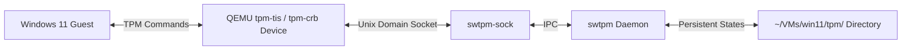

# TPM 2.0 Virtualization in QEMU/KVM (Arch Linux)

If you've ever tried installing Windows 11 in a virtual machine, you probably hit the dreaded "This PC can't run Windows 11" screen. Most of the time, this comes down to one thing: the VM doesn't have a TPM 2.0 chip. 

This guide covers what a Trusted Platform Module (TPM) actually does, why it is needed, and how we can emulate one in QEMU/KVM on Arch Linux using a software-based emulator called `swtpm`.

---

## Table of Contents

* [What actually is a TPM?](#what-actually-is-a-tpm)
* [Why does Windows 11 care so much about TPM 2.0?](#why-does-windows-11-care-so-much-about-tpm-20)
* [How Software TPM (swtpm) solves this](#how-software-tpm-swtpm-solves-this)
* [Getting swtpm installed on Arch Linux](#getting-swtpm-installed-on-arch-linux)
* [Spinning up the TPM Emulator daemon](#spinning-up-the-tpm-emulator-daemon)
* [Hooking it up to QEMU](#hooking-it-up-to-qemu)
* [Verifying it works inside the Guest VM](#verifying-it-works-inside-the-guest-vm)
* [Handling the TPM Daemon Lifecycle](#handling-the-tpm-daemon-lifecycle)
* [Troubleshooting common head-scratchers](#troubleshooting-common-head-scratchers)

---

# What actually is a TPM?

A **Trusted Platform Module (TPM)** is a tiny, dedicated security processor. On real hardware, it's either a physical chip soldered onto the motherboard or implemented in low-level CPU firmware (Intel PTT or AMD fTPM).

The main job of a TPM is to provide a hardware-based security boundary. It does this by keeping cryptographic operations off the main CPU and out of the host OS RAM where they could be snooped on. 

Specifically, a TPM handles:
* **Secure key storage**: Generating and keeping cryptographic keys locked inside the hardware. These keys cannot be directly read or copied by the OS.
* **Platform measurement (integrity checks)**: When the PC boots, the TPM takes cryptographic hashes of the UEFI/BIOS, boot loader, and kernel. If any of these have been modified (e.g. by malware/bootkits), the TPM flags the system as untrusted.
* **Hardware-accelerated cryptography**: Fast hashing (SHA-256) and key generation (RSA, ECC).
* **Sealed storage**: Encrypting sensitive data (like BitLocker keys) so that they are only decrypted if the boot environment is intact and verified.

---

# Why does Windows 11 care so much about TPM 2.0?

Microsoft made TPM 2.0 a mandatory requirement for Windows 11 to enforce a baseline level of hardware-level protection. The OS relies heavily on it to backstop its modern security features:

1. **BitLocker Drive Encryption**: BitLocker uses the TPM to store the decryption keys. If someone steals your hard drive and plugs it into another computer, the key stays locked in the original TPM, preventing them from reading your data.
2. **Windows Hello**: Pin codes, face recognition, and fingerprint data are bound to credentials stored securely in the TPM.
3. **Virtualization-Based Security (VBS)**: Enforces memory isolation for critical processes, using the TPM to verify security properties at boot.
4. **Device Guard / Credential Guard**: Protects system credentials from being extracted even if the OS is fully compromised.

---

# How Software TPM (swtpm) solves this

If we are running virtual machines, we have a problem: we can't easily share our host motherboard's physical TPM chip with multiple guest VMs. Passing the physical TPM directly to a VM is both insecure and prevents other VMs (or the host itself) from using it.

Instead, we use **`swtpm`** (Software TPM Emulator). 

`swtpm` emulates a physical TPM chip entirely in software. It runs as a background process (daemon) on the host and exposes a Unix socket that QEMU talks to. 

Here is how the data flows:



* **The Daemon (`swtpm`)**: Does the actual emulation work.
* **The Socket (`swtpm-sock`)**: Allows QEMU to pass TPM instructions back and forth to the daemon.
* **The Storage Directory (`~/VMs/win11/tpm`)**: Serves as the "virtual NVRAM" of the TPM chip. This is where the emulator writes the VM's specific keys, owner passwords, and state. If you delete this folder, you effectively clear the VM's TPM memory.

---

# Getting swtpm installed on Arch Linux

The package is available in the official Arch repositories, so installing it is simple:

```bash
sudo pacman -S swtpm
```

Quickly check the version to verify it is installed and works:

```bash
swtpm --version
```

You should see something like:
```text
TPM emulator version 0.8.x or later
```

---

# Spinning up the TPM Emulator daemon

Before launching the QEMU virtual machine, you need to spin up the `swtpm` daemon.

## 1. Create the directories
We need a dedicated folder where the emulated TPM can store its persistent state:

```bash
mkdir -p ~/VMs/win11/tpm
```

## 2. Launch the emulator daemon
Run the following command to start `swtpm` as a background process (`--daemon`):

```bash
swtpm socket \
  --tpmstate dir=$HOME/VMs/win11/tpm \
  --ctrl type=unixio,path=$HOME/VMs/win11/tpm/swtpm-sock \
  --tpm2 \
  --daemon
```

* `--tpmstate dir=...` tells the emulator where to store keys.
* `--ctrl type=unixio,path=...` creates a Unix socket file that QEMU will connect to.
* `--tpm2` ensures we are emulating TPM 2.0 (omitting this will default to TPM 1.2, which will fail Windows 11 checks).

## 3. Verify it is running
Check if the socket file was created:

```bash
ls -la ~/VMs/win11/tpm/
```

You should see the `swtpm-sock` file listed. If it isn't there, check your system logs or run `ps aux | grep swtpm` to verify if the process is active.

---

# Hooking it up to QEMU

To pass this virtual TPM chip into QEMU, add the following parameters to your QEMU launch command:

```bash
qemu-system-x86_64 \
  ... \
  -chardev socket,id=chrtpm,path=$HOME/VMs/win11/tpm/swtpm-sock \
  -tpmdev emulator,id=tpm0,chardev=chrtpm \
  -device tpm-tis,tpmdev=tpm0 \
  ...
```

Here is a breakdown of what these arguments do:
* `-chardev socket,id=chrtpm,path=...`: Tells QEMU to connect to the socket file we created with `swtpm`.
* `-tpmdev emulator,id=tpm0,chardev=chrtpm`: Creates a QEMU TPM backend using the character device socket.
* `-device tpm-tis,tpmdev=tpm0`: Emulates the physical TPM hardware interface (in this case, TPM-TIS, which is standard for Q35 machines) and attaches it to the guest.

---

# Verifying it works inside the Guest VM

Once the VM boots up, check if the guest system recognizes the TPM.

### On a Windows 11 Guest:
1. Press `Win + R`, type `tpm.msc`, and hit **Enter**.
2. If everything went smoothly, the TPM Management window will show **TPM Manufacturer Information** with a **Specification Version** of `2.0`.
3. You can also open the **Device Manager**, expand **Security devices**, and check for the **Trusted Platform Module 2.0** entry.

### On a Linux Guest (e.g. Kali or Ubuntu):
Run this in terminal to see if the kernel picked up the emulated TPM:

```bash
dmesg | grep -i tpm
```

You should see an output like:
```text
[    0.000000] tpm_tis MSFT0101:00: 2.0 TPM (device-id 0x1, rev-id 1)
```

---

# Handling the TPM Daemon Lifecycle

### Automating the startup
Since QEMU will refuse to start if the socket file is missing or `swtpm` is not running, it's best to wrap the VM launch process in a script. 

Here is a simple example that checks for the socket and starts `swtpm` if needed before firing up QEMU:

```bash
#!/bin/bash

# Path to the TPM directory and socket
TPM_DIR="$HOME/VMs/win11/tpm"
SOCKET_PATH="$TPM_DIR/swtpm-sock"

# Start the TPM daemon if the socket doesn't exist
if [ ! -S "$SOCKET_PATH" ]; then
    echo "Starting virtual TPM 2.0 daemon..."
    mkdir -p "$TPM_DIR"
    swtpm socket \
      --tpmstate dir="$TPM_DIR" \
      --ctrl type=unixio,path="$SOCKET_PATH" \
      --tpm2 \
      --daemon
    
    # Give the daemon a moment to initialize the socket
    sleep 0.5
fi

# Now boot the VM
qemu-system-x86_64 \
  -enable-kvm \
  -m 8G \
  -smp 4 \
  -chardev socket,id=chrtpm,path="$SOCKET_PATH" \
  -tpmdev emulator,id=tpm0,chardev=chrtpm \
  -device tpm-tis,tpmdev=tpm0 \
  ...
```

### Shutting down the daemon
The daemon uses almost no CPU or RAM when the VM is shut down. If you want to clean it up and kill all running `swtpm` instances on your host, you can run:

```bash
pkill swtpm
```

---

# Troubleshooting common head-scratchers

### "Failed to connect to swtpm-sock: No such file or directory"
* **Why**: The `swtpm` daemon wasn't started, or it crashed, or the path in your QEMU command is pointing to the wrong folder.
* **Fix**: Run `ps aux | grep swtpm` to verify if the process is running. Double-check that the file path specified in `--ctrl path=...` matches the path in QEMU's `-chardev path=...` parameter exactly.

### "Could not open '/path/to/swtpm-sock': Permission denied"
* **Why**: QEMU is running under a different user system-wide (common if you use `libvirtd`/`virt-manager` as root) and does not have read/write access to your home directory's socket file.
* **Fix**: If running QEMU directly as your local user (using KVM), this shouldn't happen. If you are using system-level libvirt, configure the socket directory in a shared folder like `/var/lib/libvirt/` or adjust permissions:
  ```bash
  chmod 711 $HOME/VMs/win11/tpm
  ```

### Windows reports: "Compatible TPM cannot be found"
* **Why**: The `swtpm` daemon was launched without the `--tpm2` flag, emulating an older TPM 1.2 chip instead. Alternatively, your VM is booted in legacy BIOS mode instead of UEFI.
* **Fix**: Verify your `swtpm` command has `--tpm2` included. Make sure your QEMU setup is using UEFI firmware (`edk2-ovmf`), as Windows 11 will not recognize TPM devices in BIOS mode.
