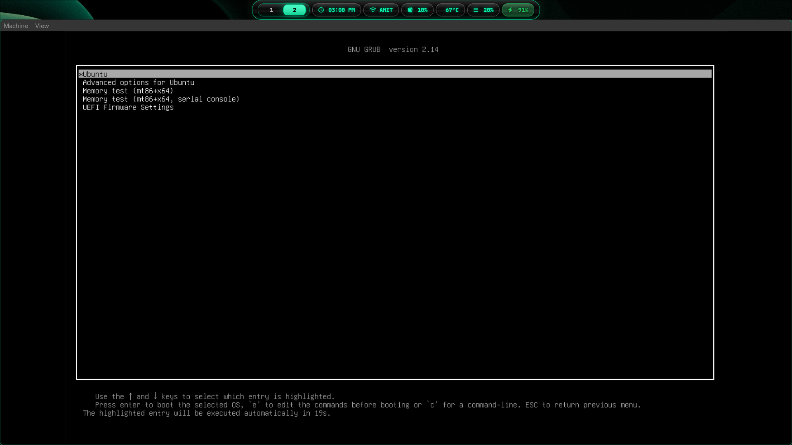
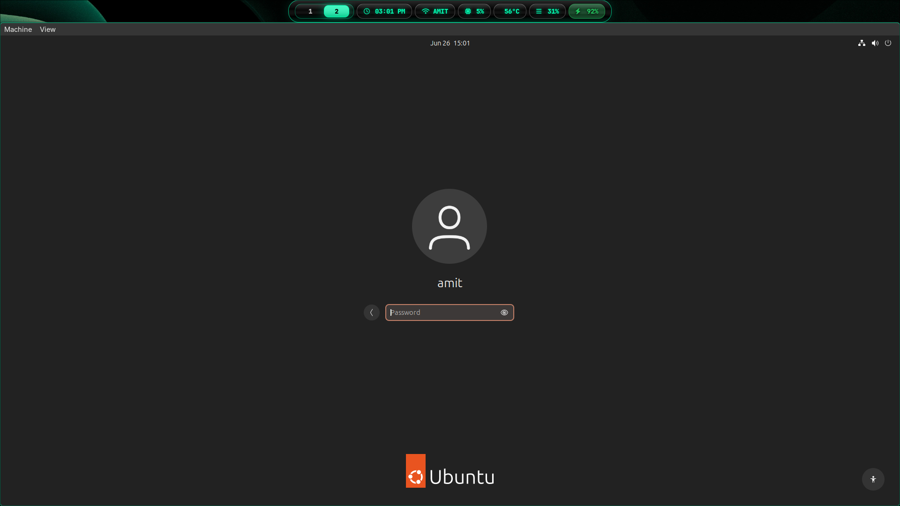
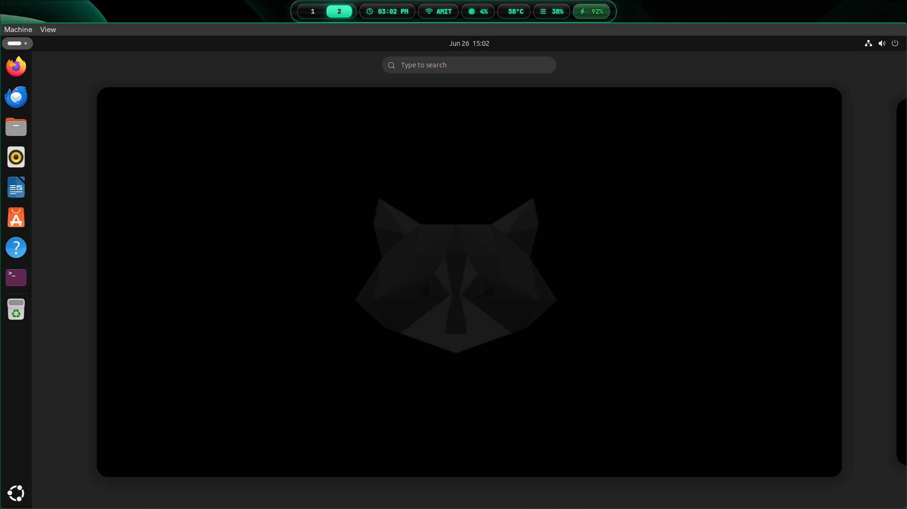

# Ubuntu Guide: Developer VM & Logging Server (B.Tech CS Lab Notes)

While having target victim machines (Windows 11, Metasploitable2) and a dedicated attacking machine (Kali Linux) is awesome, every robust cybersecurity lab needs a reliable Linux server. 

In our lab, the **Ubuntu VM** serves two main roles:
1. **Developer Workspace**: A clean Linux workstation to write tools, test firewall rules, and compile binaries.
2. **Security Logging / Utility Server**: The perfect host to run syslog aggregators, Wazuh managers, ELK stacks, or central network authentication services.

We run Ubuntu inside a high-performance QEMU/KVM virtual machine. This guide covers how to set it up step-by-step with a dual-NIC layout, UEFI boot support, and direct integration into our virtual switch.

---

## What we're covering:
* [Why Ubuntu?](#why-ubuntu)
* [VirtIO & UEFI Boot Configuration](#virtio--uefi-boot-configuration)
* [1. Creating the Ubuntu Directory](#1-creating-the-ubuntu-directory)
* [2. Creating the Virtual Disk](#2-creating-the-virtual-disk)
* [3. Creating the TAP0 Interface](#3-creating-the-tap0-interface)
* [4. The QEMU Shell Alias (Dual Network Layout)](#4-the-qemu-shell-alias-dual-network-layout)
* [5. Installing the OS (Step-by-Step Screenshots)](#5-installing-the-os-step-by-step-screenshots)
* [6. Post-Install: Static IP Configuration inside Ubuntu](#6-post-install-static-ip-configuration-inside-ubuntu)

---

# Why Ubuntu?

Ubuntu is the industry standard for cloud environments, enterprise software hosting, and developer infrastructure. Running it in our cybersecurity sandbox allows us to:
* **Host Defensive Tools**: Install a security Information and Event Management (SIEM) dashboard to capture and analyze event logs from Windows 11 or Metasploitable2.
* **Simulate Production Target Services**: Run modern Dockerized microservices, Apache web servers, or PostgreSQL databases that represent real-world targets.
* **Practice Host Hardening**: Learn how to configure UFW (Uncomplicated Firewall), audit logging, and SSH keys in a safe sandbox.

---

# VirtIO & UEFI Boot Configuration

To make the system fast and stable, we configure:
* **VirtIO Storage (`if=virtio`)**: Bypasses legacy SATA/SCSI controllers for near-native read/write speeds on your host SSD.
* **VirtIO Network Drivers (`virtio-net-pci`)**: Provides low-overhead networking.
* **UEFI Boot Support**: Uses the official EDK II OVMF firmware (`OVMF_CODE.4m.fd`) for modern, secure boot state configurations.
* **VirtIO Graphics**: Native rendering via `virtio-vga` to speed up the window environment in the GTK display.

---

# 1. Creating the Ubuntu Directory

First, create a dedicated folder inside your user home directory to store Ubuntu's disk images. We name it `ubuntu26` to keep our custom lab environments organized:

```bash
mkdir -p ~/VMs/ubuntu26
```

Download the latest **Ubuntu Desktop or Server ISO** (we'll use Ubuntu Desktop for this guide). We assume it is saved in your downloads folder: `~/Downloads/ISO/ubuntu-24.04-desktop-amd64.iso` (update version numbers in commands if you use a newer release).

---

# 2. Creating the Virtual Disk

Next, create a high-speed QCOW2 virtual disk image. We will allocate **40 GB** of virtual space. Since it's dynamically allocated, it starts small (around 2-3 GB) and only grows as you save files inside the VM.

```bash
qemu-img create -f qcow2 ~/VMs/ubuntu26/ubuntu.qcow2 40G
```

Expected output:
```text
Formatting '/home/user/VMs/ubuntu26/ubuntu.qcow2', fmt=qcow2 cluster_size=65536 extended_l2=off compression_type=zlib size=42949672960 lazy_refcounts=off refcount_bits=16
```

---

# 3. Creating the TAP0 Interface

For our network configuration, our Ubuntu VM connects to the bridge via the first TAP interface: **`tap0`**.

Before running the VM, ensure you create and connect `tap0` to our bridge on your host:

```bash
# Create the TAP device owned by your local user
sudo ip tuntap add dev tap0 mode tap user $USER

# Bind it to our virtual bridge
sudo ip link set dev tap0 master br0

# Bring it online
sudo ip link set dev tap0 up
```

*(Alternatively, you can edit `scripts/bridge.sh` on your host and add `tap0` to the `TAP_INTERFACES` list so it gets created automatically when setting up the bridge).*

---

# 4. The QEMU Shell Alias (Dual Network Layout)

Our QEMU command uses **two network devices**:
1. **Card 1 (`netdev=internet`)**: Connects to QEMU's User NAT for outbound internet access (needed to run `sudo apt update`).
2. **Card 2 (`netdev=lab`)**: Connects to `tap0`, placing the VM onto the private `192.168.100.x` bridge subnet.

To make launching the VM quick and painless, you can configure a shell **alias** in your host's `~/.bashrc` (or `~/.zshrc`).

Add this line to your `~/.bashrc`:

```bash
alias ubuntu='qemu-system-x86_64 -enable-kvm -machine q35,accel=kvm -cpu host -smp 2 -m 4G -device virtio-vga -display gtk -drive if=pflash,format=raw,readonly=on,file=/usr/share/edk2/x64/OVMF_CODE.4m.fd -drive file=$HOME/VMs/ubuntu26/ubuntu.qcow2,format=qcow2,if=virtio -netdev user,id=internet -device virtio-net-pci,netdev=internet -netdev tap,id=lab,ifname=tap0,script=no,downscript=no -device virtio-net-pci,netdev=lab,mac=52:54:00:AA:00:10 -daemonize'
```

Apply the changes to your terminal:
```bash
source ~/.bashrc
```

### Pro-tips:
1. When installing the VM for the first time, append `-cdrom $HOME/Downloads/ISO/ubuntu-XXXX.XX-desktop-amd64.iso` and remove the `-daemonize` flag temporarily from your alias so you can step through the installation interface.
2. The `-daemonize` flag runs the VM in the background, launching the display window without tying up your host terminal process.

---

# 5. Installing the OS (Step-by-Step Screenshots)

Run the modified launch command to start the installation:
```bash
# Add the installer CD-ROM to the alias command temporarily to run the install
ubuntu -cdrom ~/Downloads/ISO/ubuntu-24.04-desktop-amd64.iso
```

### Step 5.1: The Boot Screen
The Ubuntu installer GRUB bootloader will launch. Select **Try or Install Ubuntu**.



### Step 5.2: Operating System Setup
* Pick your language and keyboard configuration.
* Select the **Interactive Installation** option.
* Choose **Default selection** (standard utilities and web browser) to keep it lightweight.
* Select **Erase disk and install Ubuntu** (it will safely format our 40 GB virtual `vda` disk, not your host storage!).
* Set your username, computer name to `ubuntu-server`, and choose a secure password.

### Step 5.3: Completed Installation & Login Screen
Once the installer finishes copying files, click **Restart Now**. Remove the `-cdrom` argument to boot directly from your virtual disk using your standard alias.

You will be greeted by the Ubuntu GDM Login Manager:



Log in with the credentials you configured.

### Step 5.4: The Desktop Environment
You will load into the default Ubuntu GNOME Desktop.



---

# 6. Post-Install: Static IP Configuration inside Ubuntu

Open a terminal inside the Ubuntu VM and check your network interfaces:
```bash
ip link show
```

You should see two ethernet cards (excluding the loopback `lo`):
1. `ens3` (or `eth0`): Connected to NAT (usually auto-configured at `10.0.2.15` for internet access).
2. `ens4` (or `eth1`): Connected to `tap0` and our private `br0` bridge. It currently has no IP address.

We want to assign a static IP of **`192.168.100.40`** to the second card.

### Option A: Using the GNOME GUI Settings (Desktop Users)

1. Open the **Settings** menu and click on the **Network** tab in the sidebar.
2. Under **Wired**, you should see two connections listed. Identify the second connection (corresponds to interface `ens4`).
3. Click the **Gear icon** next to it to edit its settings.
4. Select the **IPv4** tab.
5. Change IPv4 Method from **Automatic (DHCP)** to **Manual**.
6. Under **Addresses**, input:
   * **Address**: `192.168.100.40`
   * **Netmask**: `255.255.255.0`
   * **Gateway**: *Leave empty!* (Setting a gateway here will hijack your default route, cutting off your VM's internet).
7. Click **Apply**. Turn the connection switch off and then back on to apply the settings.

### Option B: Using Netplan (Standard for Ubuntu Server / Desktop CLI)

Modern Ubuntu releases use **Netplan** to manage networking configs. Open a terminal inside the VM and create a custom netplan YAML file:

```bash
sudo nano /etc/netplan/99-custom-static.yaml
```

Paste the following configurations (ensure you verify whether your second interface is named `ens4` or `eth1` using `ip a` first):

```yaml
network:
  version: 2
  renderer: networkd
  ethernets:
    ens4:
      dhcp4: no
      addresses:
        - 192.168.100.40/24
```

Apply the network configuration changes:
```bash
sudo netplan apply
```

### Option C: Temporary Manual Testing (Quick Test)

If you just want to run a quick test without editing persistent configuration files, bind the IP directly in the terminal:

```bash
# Add the IP address to ens4
sudo ip addr add 192.168.100.40/24 dev ens4

# Bring the interface up
sudo ip link set dev ens4 up
```

---

# Verification check

Verify your dual networking works by running two quick tests from the Ubuntu terminal:
1. Test outer network routing: `ping -c 3 google.com` (should get responses back).
2. Test inner bridge networking: `ping -c 3 192.168.100.10` (should successfully ping your Kali Linux VM at its static IP if it is running).

If both work, your Ubuntu developer/logging node is fully set up and ready to participate in the cybersecurity lab!
