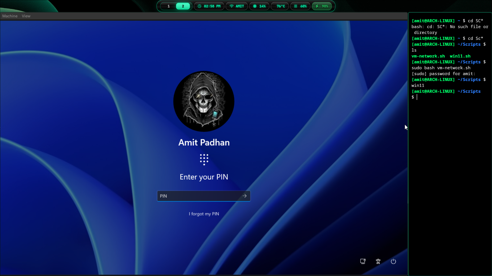
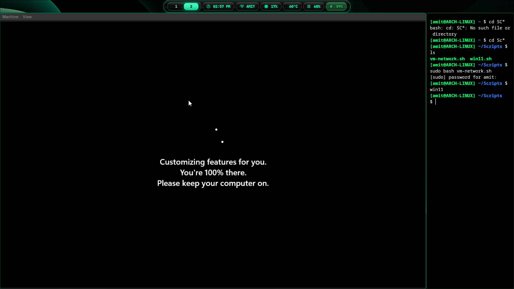
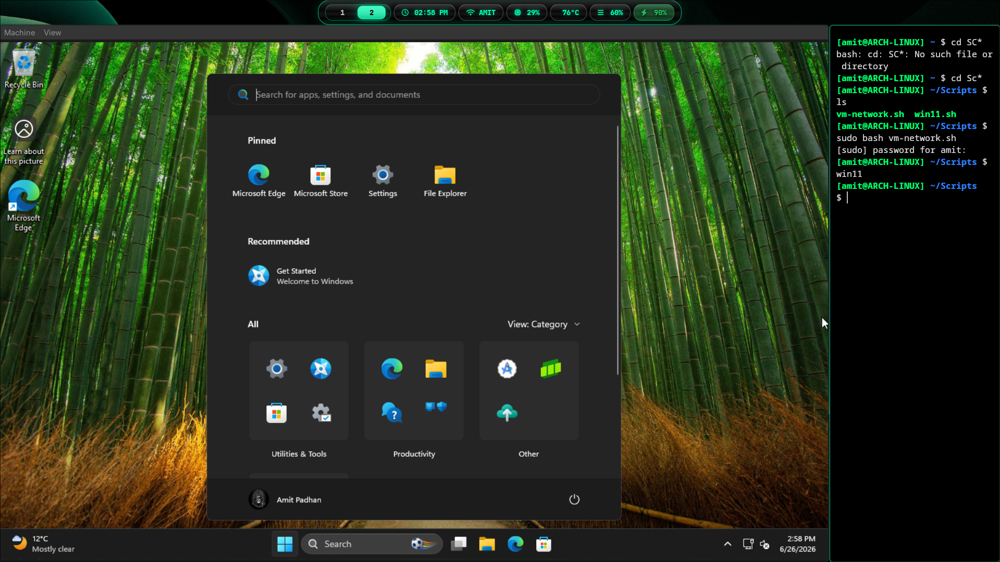
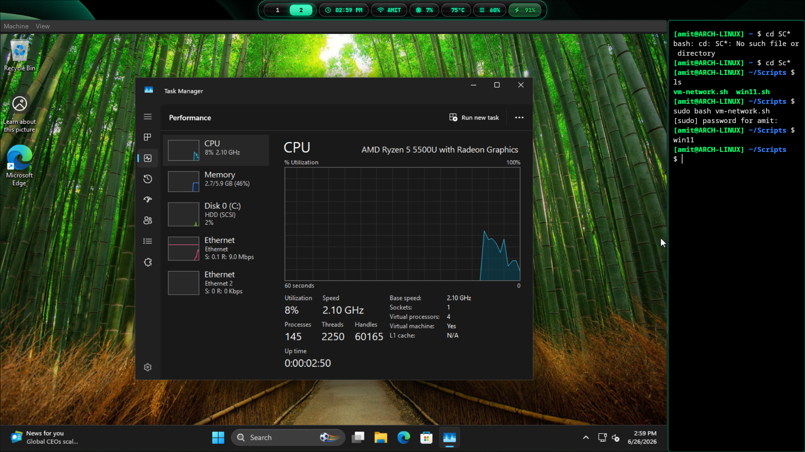

# Windows 11 Installation on QEMU/KVM (Arch Linux)

> A complete guide to installing Windows 11 on QEMU/KVM using UEFI, Secure Boot, TPM 2.0, VirtIO drivers, and dual networking on Arch Linux.

---

## Table of Contents

* [Overview](#overview)
* [Features](#features)
* [Host Operating System](#host-operating-system)
* [Hardware Requirements](#hardware-requirements)
* [Required Packages](#required-packages)
* [Verify KVM](#verify-kvm)
* [Download Required Files](#download-required-files)
* [Directory Structure](#directory-structure)
* [Create the Virtual Disk](#create-the-virtual-disk)
* [Configure UEFI](#configure-uefi)
* [Configure TPM 2.0](#configure-tpm-20)
* [Launch Windows 11 Installer](#launch-windows-11-installer)
* [Understanding the Command](#understanding-the-command)
* [Boot Process](#boot-process)
* [Windows Setup & Installation](#windows-setup)
* [Windows Out-of-Box Experience (OOBE)](#windows-out-of-box-experience-oobe)
* [Post-Installation Verification](#verify-device-manager)
* [Performance Optimization](#performance-optimization)
* [Snapshots](#snapshots)
* [Troubleshooting](#troubleshooting)
* [Final QEMU Launch Command (Post-Installation)](#final-qemu-launch-command-post-installation)
* [Appendix](#appendix)

---

# Overview

This guide explains how to install Windows 11 on QEMU/KVM using modern virtualization technologies available on Linux.

The virtual machine uses:

* QEMU
* KVM
* OVMF (UEFI)
* Secure Boot
* TPM 2.0
* VirtIO Storage
* VirtIO Network
* OpenGL Graphics
* USB Tablet

The result is a Windows 11 virtual machine capable of:

* Internet access
* Internal lab networking
* Hardware virtualization
* Secure Boot support
* TPM 2.0 support
* High-performance VirtIO devices

---

# Features

* Windows 11 25H2
* UEFI Boot
* Secure Boot
* TPM 2.0
* VirtIO Storage
* VirtIO Networking
* OpenGL Graphics
* Internet Access
* Internal TAP Network
* QEMU Guest Drivers
* High Performance Storage
* Hardware Virtualization

---

# Host Operating System

The guide was tested on:

```
Arch Linux
Kernel 7.x
QEMU
KVM
Hyprland
```

---

# Hardware Requirements

Minimum

| Component | Requirement                    |
| --------- | ------------------------------ |
| CPU       | 64-bit CPU with virtualization |
| RAM       | 8 GB (6 GB recommended for Windows 11 VM) |
| Storage   | 100 GB free (at least 64 GB for Windows 11 VM) |
| BIOS      | AMD-V / Intel VT-x Enabled     |

Recommended

| Component | Recommendation                    |
| --------- | --------------------------------- |
| CPU       | Ryzen 5 / Intel Core i5 or better |
| RAM       | 16 GB or more                     |
| Storage   | NVMe SSD                          |
| GPU       | Any GPU supporting OpenGL (Tested on host without a dedicated GPU / dGPU) |

---

# Required Packages

Install the required software.

```bash
sudo pacman -S \
qemu-full \
edk2-ovmf \
swtpm \
bridge-utils \
dnsmasq
```

---

# Verify KVM

Verify virtualization support.

```bash
lsmod | grep kvm
```

Expected output:

```
kvm
kvm_amd
```

or

```
kvm
kvm_intel
```

---

# Download Required Files

Download the following files.

## Windows 11 ISO

Example:

```
Win11_25H2_English_x64_v2.iso
```

## VirtIO Driver ISO

```
virtio-win-0.1.285.iso
```

Store them inside

```
~/Downloads/ISO
```

Example

```
~/Downloads/ISO

├── Win11_25H2_English_x64_v2.iso
└── virtio-win-0.1.285.iso
```

---

# Directory Structure

Create a directory for the virtual machine.

```bash
mkdir -p ~/VMs/win11
```

Recommended layout:

```
~/VMs/

└── win11
    ├── win11.qcow2
    ├── OVMF_VARS_SECBOOT.fd
    └── tpm/
```

---

# Create the Virtual Disk

Create a 100 GB QCOW2 disk.

```bash
qemu-img create \
-f qcow2 \
~/VMs/win11/win11.qcow2 \
100G
```

Expected output

```
Formatting 'win11.qcow2'
```

---

# Configure UEFI

Copy the writable UEFI variables file.

```bash
cp /usr/share/edk2/x64/OVMF_VARS.4m.fd \
~/VMs/win11/OVMF_VARS_SECBOOT.fd
```

This file stores:

* Boot Order
* Secure Boot Variables
* UEFI Settings
* NVRAM

Each VM should have its own copy.

---

# Configure TPM 2.0

Create the TPM directory.

```bash
mkdir -p ~/VMs/win11/tpm
```

Start the software TPM.

```bash
swtpm socket \
--tpmstate dir=$HOME/VMs/win11/tpm \
--ctrl type=unixio,path=$HOME/VMs/win11/tpm/swtpm-sock \
--tpm2 \
--daemon
```

Verify the socket.

```bash
ls ~/VMs/win11/tpm
```

Expected output

```
swtpm-sock
```

---

# Verify Downloads

```
~/Downloads/ISO

├── Win11_25H2_English_x64_v2.iso
└── virtio-win-0.1.285.iso
```

---

# Ready for Installation

At this point the following components should be prepared.

* Windows ISO
* VirtIO Driver ISO
* TPM 2.0
* UEFI Variables
* QCOW2 Disk
* Required Packages
* KVM Enabled

The virtual machine is now ready to boot the Windows installer.
---

# Launch Windows 11 Installer

Once all required files have been prepared, launch the virtual machine.

## QEMU Launch Command

```bash
qemu-system-x86_64 \
-enable-kvm \
-machine q35,smm=on,accel=kvm \
-cpu host \
-smp 4 \
-m 8G \
-boot order=d \
-display gtk,gl=on \
-device virtio-vga-gl \
-device qemu-xhci \
-device usb-tablet \
-drive if=pflash,format=raw,readonly=on,file=/usr/share/edk2/x64/OVMF_CODE.secboot.4m.fd \
-drive if=pflash,format=raw,file=$HOME/VMs/win11/OVMF_VARS_SECBOOT.fd \
-drive file=$HOME/VMs/win11/win11.qcow2,format=qcow2,if=virtio \
-cdrom $HOME/Downloads/ISO/Win11_25H2_English_x64_v2.iso \
-drive file=$HOME/Downloads/ISO/virtio-win-0.1.285.iso,media=cdrom \
-netdev user,id=internet \
-device virtio-net-pci,netdev=internet \
-netdev tap,id=lab,ifname=tap3,script=no,downscript=no \
-device virtio-net-pci,netdev=lab,mac=52:54:00:AA:00:13 \
-chardev socket,id=chrtpm,path=$HOME/VMs/win11/tpm/swtpm-sock \
-tpmdev emulator,id=tpm0,chardev=chrtpm \
-device tpm-tis,tpmdev=tpm0
```

---

# Understanding the Command

## CPU

```text
-cpu host
```

Uses the host CPU features for better performance.

---

## Memory

```text
-m 8G
```

Allocates 8 GB RAM.

---

## CPU Cores

```text
-smp 4
```

Assigns four virtual CPU cores.

---

## Graphics

```text
-display gtk,gl=on
-device virtio-vga-gl
```

Provides hardware accelerated graphics using OpenGL.

---

## UEFI

```text
OVMF_CODE.secboot.4m.fd
```

Provides Secure Boot compatible UEFI firmware.

---

## TPM

```text
-device tpm-tis
```

Provides TPM 2.0 required by Windows 11.

---

## VirtIO Disk

```text
-drive file=win11.qcow2,if=virtio
```

Uses a high-performance virtual storage controller.

---

## VirtIO Network

The VM has two network adapters.

### Internet

```text
User Networking (NAT)
```

Provides Internet access.

---

### Lab Network

```text
tap3
```

Allows communication with:

* Ubuntu
* Kali Linux
* Metasploitable2

---

# Boot Process

After starting the VM you should see

```
Press any key to boot from CD or DVD...
```

Immediately press:

```
Enter
```

or

```
Space
```

If no key is pressed, the firmware skips the installer and attempts to boot from another device.

---

# Windows Setup

Select

* Language
* Keyboard Layout
* Time Zone

Click

```
Next
```

Then

```
Install Now
```

---

# Product Key

Choose one of the following.

## Option 1

Enter a valid Windows license key.

## Option 2

Click

```
I don't have a product key
```

Windows can be activated later.

---

# Select Windows Edition

Choose the edition matching your license.

Example

```
Windows 11 Pro
```

Click

```
Next
```

---

# License Agreement

Accept the Microsoft Software License Terms.

Click

```
Next
```

---

# Installation Type

Select

```
Custom: Install Windows only (Advanced)
```

Do **not** choose Upgrade.

---

# No Drives Found

At this stage Windows may display

```
No drives were found.
```

This is expected because Windows does not include VirtIO storage drivers.

Click

```
Load Driver
```

---

# Browse the VirtIO CD

Navigate to

```
viostor

└── w11

    └── amd64
```

Select the **INF** driver.

Click

```
Next
```

Windows loads the storage driver.

The virtual disk should now appear.

---

# If the Disk Still Does Not Appear

Try

```
vioscsi

└── w11

    └── amd64
```

Some storage configurations require the VirtIO SCSI driver.

---

# Partition the Disk

Select the unallocated disk.

Click

```
New
```

Accept the suggested partition size.

Windows automatically creates the required partitions.

Example

* EFI System Partition
* Microsoft Reserved Partition
* Primary Partition
* Recovery Partition

---

# Install Windows

Select the Primary partition.

Click

```
Next
```

Windows begins installing.

The installation includes

* Copying Windows files
* Installing features
* Installing updates
* Preparing for first boot

The system will reboot several times.

Do **not** interrupt the installation.

---

# Important

After the first reboot, **do not press a key** when you see

```
Press any key to boot from CD or DVD...
```

If you press a key again, the installer restarts from the beginning.

Allow the VM to boot automatically from the virtual disk.

---

# Windows 11 Hardware Requirements

If you receive

```
This PC doesn't meet Windows 11 requirements.
```

Check the following.

* TPM 2.0 enabled
* Secure Boot enabled
* UEFI firmware
* At least 4 GB RAM
* At least 64 GB virtual disk

This guide satisfies all of these requirements.

---

# Initial Configuration

After installation completes, Windows starts the Out-of-Box Experience (OOBE).

The next section covers:

* Network setup
* Microsoft account
* Offline installation
* Installing VirtIO network drivers
* Guest tools
* Final optimization
---

# Windows Out-of-Box Experience (OOBE)

After Windows finishes installing, it enters the Out-of-Box Experience (OOBE).

This section covers:

* Region
* Keyboard Layout
* Network Setup
* Microsoft Account
* Offline Installation
* VirtIO Network Driver
* Guest Tools
* Windows Update

---

# Select Region

Choose your country or region.

Example

```text
India
```

Click

```text
Yes
```

---

# Keyboard Layout

Choose your keyboard layout.

Example

```text
US
```

Click

```text
Yes
```

If you do not need another layout, click

```text
Skip
```

---

# Network Setup

If Windows detects the VirtIO network driver automatically, connect to your network and continue.

If Windows displays

```text
Let's connect you to a network
```

but no network adapters appear, the VirtIO network driver is not installed.

---

# Install VirtIO Network Driver

Click

```text
Install driver
```

Browse to the VirtIO ISO.

Navigate to

```text
NetKVM

└── w11

    └── amd64
```

Select the INF file.

Click

```text
Next
```

Windows installs the VirtIO network adapter.

After installation, available networks should appear.

---

# Offline Installation (Optional)

If you prefer to complete the installation without Internet access:

Press

```text
Shift + F10
```

A Command Prompt opens.

Run

```cmd
OOBE\BYPASSNRO
```

The VM restarts.

After reboot, choose

```text
I don't have Internet
```

Then choose

```text
Continue with limited setup
```

This allows Windows installation without signing in to a Microsoft account.

---

# Create User Account

Enter

* Username
* Password (optional)
* Security Questions

Click

```text
Next
```

---

# Privacy Settings

Configure the desired privacy options.

Examples

* Location
* Diagnostic Data
* Find My Device
* Advertising ID
* Tailored Experiences

Click

```text
Accept
```

---

# First Boot

Windows prepares the desktop.

The first login may take several minutes.

Do not close the virtual machine.



---

# Install VirtIO Guest Tools

Once the Windows desktop appears, open File Explorer.

Open the VirtIO CD.

Run

```text
virtio-win-guest-tools.exe
```

Install all recommended drivers.

The installer includes

* VirtIO Storage
* VirtIO Network
* Balloon Driver
* QEMU Guest Agent
* Memory Driver
* Additional Device Drivers

Restart Windows after installation.

---

# Windows Update

Open

```text
Settings

→ Windows Update
```

Install all available updates.



Restart the VM if required.

Repeat until no updates remain.

---

# Verify Device Manager

Open

```text
Device Manager
```

Ensure there are no devices marked with:

```text
⚠ Unknown Device
```

or

```text
⚠ Yellow Warning Icon
```

If unknown devices remain, reinstall the VirtIO Guest Tools.

---

# Verify Network

Open Command Prompt.

Run

```cmd
ipconfig
```

Verify

* Internet Adapter
* TAP Adapter (if configured)
* IPv4 Address
* Default Gateway

Test connectivity.

```cmd
ping 8.8.8.8
```

Then

```cmd
ping google.com
```

Both commands should succeed.

---

# Verify TPM

Press

```text
Win + R
```

Run

```text
tpm.msc
```

Expected result

```text
TPM Manufacturer Information

Specification Version: 2.0
```

---

# Verify Secure Boot

Press

```text
Win + R
```

Run

```text
msinfo32
```

Verify

```text
BIOS Mode

UEFI
```

and

```text
Secure Boot State

On
```

---

# Verify Windows Activation

Open

```text
Settings

→ System

→ Activation
```

Windows may display

```text
Windows is not activated.
```

The VM remains fully functional.

Activation can be completed later using a valid license key.

---

# Remove Installation ISO

After confirming Windows boots successfully, remove the installation media from the QEMU command.

Remove

```text
-cdrom Win11_25H2_English_x64_v2.iso
```

Also remove

```text
-boot order=d
```

Keep the VirtIO ISO attached only if additional drivers are still needed.

---

# Current VM Status

At this stage, the VM should support

* Windows 11
* UEFI
* Secure Boot
* TPM 2.0
* VirtIO Storage
* VirtIO Networking
* Internet Access
* Lab Networking
* OpenGL Graphics
* QEMU Guest Drivers

The Windows installation is now complete and ready for daily use or cybersecurity lab activities.



---
---

# Performance Optimization

This section covers several optimizations to improve the performance of the Windows 11 virtual machine.



---

# Recommended Virtual Machine Resources

| Resource | Recommended   |
| -------- | ------------- |
| CPU      | 4 vCPUs       |
| Memory   | 8 GB          |
| Disk     | 100 GB QCOW2  |
| Graphics | virtio-vga-gl |
| Display  | GTK + OpenGL  |
| Firmware | UEFI (OVMF)   |
| TPM      | TPM 2.0       |

---

# CPU Optimization

Use the host CPU features.

```text
-cpu host
```

Benefits

* Better performance
* Hardware acceleration
* Native instruction support

---

# Memory Allocation

Example

```text
-m 8G
```

Recommended values

| Host RAM | Guest RAM |
| -------- | --------- |
| 16 GB    | 6 GB      |
| 24 GB    | 8 GB      |
| 32 GB    | 12 GB     |

Avoid allocating all host memory to the VM.

---

# Graphics

Use VirtIO GPU with OpenGL acceleration.

```text
-display gtk,gl=on
-device virtio-vga-gl
```

Advantages

* Better desktop responsiveness
* Improved rendering
* Lower CPU usage

---

# Storage Optimization

Use the QCOW2 format.

Example

```text
-drive file=win11.qcow2,format=qcow2,if=virtio
```

Benefits

* Snapshots
* Dynamic disk allocation
* Efficient storage usage

---

# Networking

Recommended configuration

### Internet

```text
-netdev user,id=internet
-device virtio-net-pci,netdev=internet
```

### Internal Lab Network

```text
-netdev tap,id=lab,ifname=tap3,script=no,downscript=no
-device virtio-net-pci,netdev=lab
```

This configuration provides

* Internet access
* Communication with other virtual machines
* Isolated cybersecurity lab environment

---

# Snapshots

Create snapshots before making major changes.

Example

```bash
qemu-img snapshot -c clean-install ~/VMs/win11/win11.qcow2
```

List snapshots

```bash
qemu-img snapshot -l ~/VMs/win11/win11.qcow2
```

Restore a snapshot

```bash
qemu-img snapshot -a clean-install ~/VMs/win11/win11.qcow2
```

Snapshots are useful before

* Windows Updates
* Driver installation
* Malware analysis
* Software testing

---

# Troubleshooting

## "This PC can't run Windows 11"

Possible causes

* Secure Boot disabled
* TPM 2.0 unavailable
* UEFI not configured
* Insufficient RAM
* Disk smaller than 64 GB

Solution

* Use `OVMF_CODE.secboot.4m.fd`
* Enable TPM 2.0
* Use UEFI firmware
* Allocate at least 4 GB RAM
* Use a 64 GB or larger virtual disk

---

## No Drives Found

Cause

Windows cannot detect the VirtIO storage controller.

Solution

Click

```text
Load Driver
```

Navigate to

```text
viostor

└── w11

    └── amd64
```

Load the driver and continue.

---

## No Network Detected

Cause

VirtIO network driver is not installed.

Solution

Browse to

```text
NetKVM

└── w11

    └── amd64
```

Install the driver.

---

## TPM Socket Error

Error

```text
Failed to connect to swtpm-sock
```

Solution

Start the TPM emulator before launching QEMU.

```bash
swtpm socket \
--tpmstate dir=$HOME/VMs/win11/tpm \
--ctrl type=unixio,path=$HOME/VMs/win11/tpm/swtpm-sock \
--tpm2 \
--daemon
```

---

## PXE Boot Instead of Windows Installer

Cause

No key was pressed when prompted.

Message

```text
Press any key to boot from CD or DVD...
```

Solution

Restart the VM and press **Enter** or **Space** immediately.

---

## Windows Installer Starts Again

Cause

The installation ISO is still attached and the VM boots from it.

Solution

Remove

```text
-cdrom Win11_25H2_English_x64_v2.iso
```

from the launch command after Windows has been installed.

---

# Final QEMU Launch Command (Post-Installation)

```bash
qemu-system-x86_64 \
-enable-kvm \
-machine q35,smm=on,accel=kvm \
-cpu host \
-smp 4 \
-m 8G \
-display gtk,gl=on \
-device virtio-vga-gl \
-device qemu-xhci \
-device usb-tablet \
-drive if=pflash,format=raw,readonly=on,file=/usr/share/edk2/x64/OVMF_CODE.secboot.4m.fd \
-drive if=pflash,format=raw,file=$HOME/VMs/win11/OVMF_VARS_SECBOOT.fd \
-drive file=$HOME/VMs/win11/win11.qcow2,format=qcow2,if=virtio \
-netdev user,id=internet \
-device virtio-net-pci,netdev=internet \
-netdev tap,id=lab,ifname=tap3,script=no,downscript=no \
-device virtio-net-pci,netdev=lab,mac=52:54:00:AA:00:13 \
-chardev socket,id=chrtpm,path=$HOME/VMs/win11/tpm/swtpm-sock \
-tpmdev emulator,id=tpm0,chardev=chrtpm \
-device tpm-tis,tpmdev=tpm0
```

---

# Next Steps

Your Windows 11 VM is now ready for:

* Cybersecurity labs
* Active Directory practice
* Malware analysis (in isolated environments)
* Software development
* Web testing
* Reverse engineering
* General Windows usage

---

# References

* QEMU Documentation
* KVM Documentation
* OVMF (EDK II)
* SWTPM
* VirtIO Drivers
* Microsoft Windows 11 Documentation

---

# Contributing

Contributions are welcome.

If you find errors, have suggestions, or would like to improve this guide, feel free to open an issue or submit a pull request.

---

# License

This documentation is released under the MIT License.
---

# Appendix

This appendix contains useful commands, directory layouts, verification steps, and maintenance tasks for the Windows 11 virtual machine.

---

# Project Directory Layout

```text
~/VMs/

└── win11/
    ├── win11.qcow2
    ├── OVMF_VARS_SECBOOT.fd
    └── tpm/
        ├── swtpm-sock
        └── ...
```

---

# ISO Directory

```text
~/Downloads/

└── ISO/
    ├── Win11_25H2_English_x64_v2.iso
    └── virtio-win-0.1.285.iso
```

---

# Useful Commands

## Check QEMU Version

```bash
qemu-system-x86_64 --version
```

---

## Check KVM Support

```bash
lsmod | grep kvm
```

---

## Check CPU Virtualization

AMD

```bash
lscpu | grep Virtualization
```

Intel

```bash
egrep -c '(vmx|svm)' /proc/cpuinfo
```

---

## Check SWTPM Version

```bash
swtpm --version
```

---

## Check OVMF Files

```bash
ls /usr/share/edk2/x64/
```

Example

```text
MICROVM.4m.fd
OVMF.4m.fd
OVMF_CODE.4m.fd
OVMF_CODE.secboot.4m.fd
OVMF_VARS.4m.fd
```

---

# Start TPM

```bash
mkdir -p "$HOME/VMs/win11/tpm"

swtpm socket \
--tpmstate dir="$HOME/VMs/win11/tpm" \
--ctrl type=unixio,path="$HOME/VMs/win11/tpm/swtpm-sock" \
--tpm2 \
--daemon
```

---

# Stop TPM

```bash
pkill swtpm
```

---

# Check TPM Process

```bash
ps aux | grep swtpm
```

---

# Verify QCOW2 Disk

```bash
qemu-img info ~/VMs/win11/win11.qcow2
```

---

# Resize the Virtual Disk

Increase the disk by 20 GB.

```bash
qemu-img resize ~/VMs/win11/win11.qcow2 +20G
```

Extend the partition from inside Windows using **Disk Management**.

---

# Convert QCOW2 to RAW

```bash
qemu-img convert \
-f qcow2 \
-O raw \
win11.qcow2 \
win11.img
```

---

# Compact the Disk

Zero free space inside Windows, then run

```bash
qemu-img convert \
-O qcow2 \
win11.qcow2 \
win11-compact.qcow2
```

---

# Backup the VM

```bash
cp -av ~/VMs/win11 ~/VM_Backups/
```

---

# Restore the VM

```bash
cp -av ~/VM_Backups/win11 ~/VMs/
```

---

# Export the VM

Files required

```text
win11.qcow2
OVMF_VARS_SECBOOT.fd
tpm/
```

The installation ISO is **not** required after installation.

---


# Changelog

## Version 1.0

* Initial Windows 11 installation guide
* Secure Boot configuration
* TPM 2.0 setup
* VirtIO storage configuration
* VirtIO networking
* Guest tools installation
* Performance optimization
* Troubleshooting guide

---

# Acknowledgements

Thanks to the developers and communities behind:

* QEMU
* KVM
* EDK II (OVMF)
* SWTPM
* VirtIO
* Arch Linux

for providing the open-source technologies that make this virtualization environment possible.

---

**End of Document**

