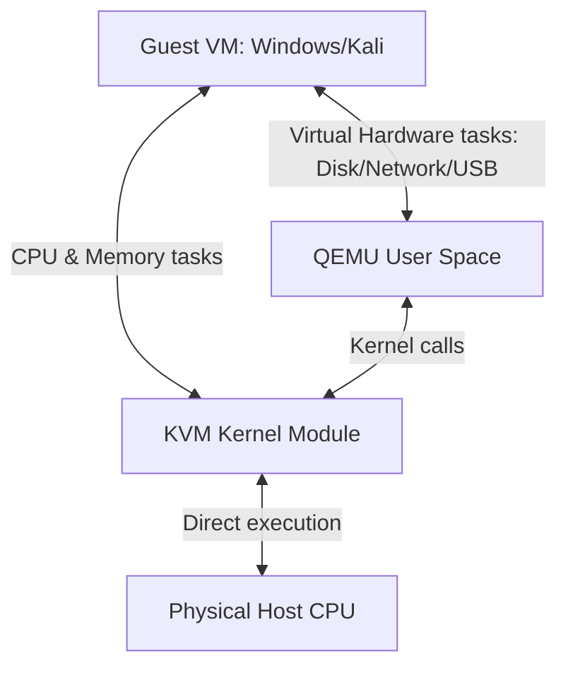

# QEMU, KVM, and how they work together (Arch Linux Vibe)

If you are setting up virtual machines on Linux, you will keep hearing the terms **QEMU**, **KVM**, and **QEMU/KVM**. 

Honestly, when I first started my B.Tech lab, I thought they were all the same thing. They aren't. They do completely different jobs, but when they team up, they create a super-fast hypervisor.

Here is a simple breakdown of what they are and how they work.

---

## The short version:
* **QEMU**: Emulates the hardware (disks, network card, graphics, USB controllers).
* **KVM**: Runs the guest CPU instructions directly on your host CPU at native speed.
* **QEMU with KVM**: QEMU handles the virtual hardware, while KVM makes it run blazing fast by using hardware virtualization.

---

# What is QEMU?

**QEMU (Quick Emulator)** is a complete software-based emulator. 

Basically, it's a program that mimics an entire computer in user space. If you tell QEMU to boot an OS, it will create virtual RAM, virtual hard disks, virtual USB ports, virtual graphics cards, and a virtual network card.

Because QEMU is a pure emulator, it can even run operating systems designed for a different CPU architecture (for example, you can run an ARM-based Raspberry Pi OS on your x86_64 Arch Linux laptop). 

### The Problem:
If QEMU has to translate every single instruction in software, it is **painfully slow**. Doing pure CPU emulation in software feels like trying to run Windows 11 on a toaster.

---

# What is KVM?

**KVM (Kernel-based Virtual Machine)** is a Linux kernel module (`kvm.ko`) that turns the Linux kernel itself into a Type-1 hypervisor.

KVM allows guest operating systems to talk directly to your physical host CPU. If the guest OS wants to run a basic math calculation on the CPU, KVM lets it run directly on your AMD or Intel chip without any software translation. 

It does this by leveraging hardware virtualization extensions:
* **Intel VT-x**
* **AMD-V**

### The Problem:
KVM *only* virtualizes the CPU and memory. It doesn't know how to emulate a SATA controller, a USB keyboard, a network interface card, or a display screen. On its own, KVM can't run a full virtual machine because the VM wouldn't have a motherboard, disks, or a screen.

---

# How QEMU and KVM team up

This is where the magic happens. QEMU and KVM work as a team:

1. **KVM handles the heavy lifting**: The CPU instructions and RAM management go straight to KVM, which runs them at native speed on your actual processor.
2. **QEMU handles the virtual PC**: QEMU emulates the motherboard, BIOS, UEFI, VirtIO disk controller, graphics card, USB keyboard, and mouse. 

When you run `qemu-system-x86_64 -enable-kvm ...`, you are telling QEMU: *"Hey, emulate the disk and graphics card, but let KVM run the CPU instructions directly on the host hardware."*

This combination is why QEMU/KVM virtual machines are way faster than software-only emulators, and often match or beat VirtualBox and VMware in performance.
